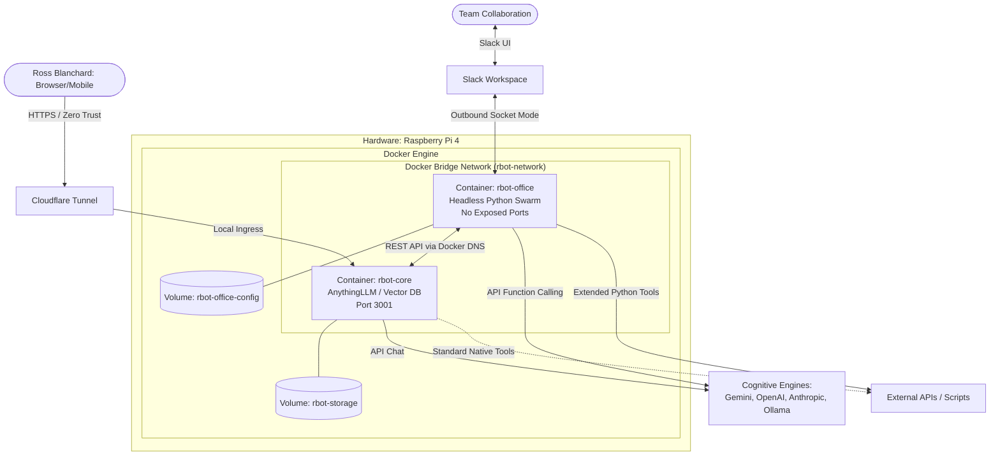
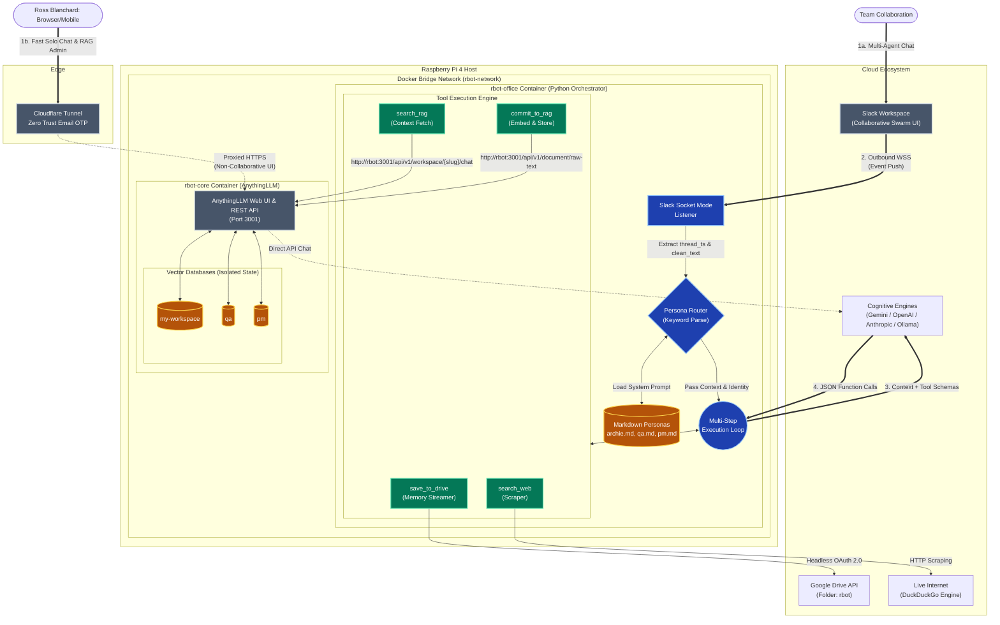

# 🧠 rbot: Sovereign "Second Brain" & Omnichannel AI Platform

Welcome to **rbot** — a highly modular, decoupled, multi-agent AI ecosystem designed to run entirely on a localized Raspberry Pi 4 homelab. 

Architected by Ross Blanchard and Archie (an AI Systems Architect), the `rbot` system solves two massive problems with modern AI tools: **Amnesia** and **Subscription Fatigue**.

1. **The Amnesiac AI Problem:** By permanently separating the Cognitive Engine (LLM APIs) from the Vector Memory (AnythingLLM) and the Collaboration Interface (Slack), `rbot` provides an omnichannel, context-aware AI team that retains permanent memory of past architectural decisions, code reviews, and project specs.
2. **The Economic Problem:** Instead of paying $20+ a month for locked-in subscriptions to multiple AI chat products, `rbot` operates on a highly economical **Pay-As-You-Go** model. You can switch between flagship providers (Google Gemini, OpenAI, Anthropic) on the fly. Furthermore, the system's modularity allows simple, low-complexity agentic personas to be routed to local, self-hosted LLMs (like Ollama), driving inference costs down to absolute zero.

## 🏗️ High-Level Architecture

The system utilizes an **Interface Segregation** pattern, allowing for two distinct ways to interact with the AI depending on the cognitive load of the task. Both interfaces read and write to the exact same memory brain, and both can mix-and-match LLM providers seamlessly.

1. **The Solo Workbench (`rbot-core`):** A fast, distraction-free Web UI (powered by AnythingLLM) secured behind a Cloudflare Zero Trust tunnel. Ideal for administration, solo research, document uploading, and rapid chatting with any major LLM API.
2. **The Collaborative Swarm (`rbot-office`):** A headless Python orchestration engine connected to Slack via outbound WebSockets. Ideal for multi-human, multi-agent collaboration, autonomous tool execution, and code review.

## 🔍 Detailed System Topology & Execution Flow

When a user interacts with the `rbot-office` collaborative swarm, the system dynamically routes the request, loads the appropriate persona, and executes a multi-step reasoning loop using the currently selected LLM provider.

## ✨ Core Features

- **Provider Agnostic & Economical:** Switch freely between Google Gemini, OpenAI, and Anthropic APIs on the fly in both the Web UI and the Slack Swarm. Route simple tasks to local LLMs (like Ollama) to reduce inference costs to zero, escaping the $20/month subscription trap.
- **Omnichannel RAG Persistence:** Decisions made in a Slack thread can be autonomously summarized by the AI (`commit_to_rag` tool) and pushed directly into the central vector database. Those memories can later be recalled in Slack (`search_rag` tool) or directly in the Web UI.
- **Dynamic Persona Routing:** The Slack swarm isn't just one bot. By analyzing keyword triggers (e.g., `archie`, `qa`, `pm`), the Python engine dynamically hot-swaps system prompts and routes queries to strictly segregated vector databases to prevent cross-persona hallucinations (Identity Dysmorphia).
- **Role-Based Access Control (RBAC):** Critical infrastructure tools (like writing to Google Drive or committing to the RAG database) are cryptographically locked to a specific Slack Admin ID.
- **Headless Tool Execution:** The Python swarm utilizes headless OAuth to stream finalized markdown documents and system specs directly from RAM to the `rbot` Google Drive folder, bypassing brittle SD card writes.
- **Multi-Step Reasoning Loops:** The Python orchestrator utilizes a `while` execution loop, allowing the active cognitive engine to chain multiple tools together (e.g., *Search the Live Web -> Read the Results -> Synthesize a Spec -> Commit to RAG*) entirely autonomously.

## 📂 Repository Structure

This repository is split into two primary domains:

- `/docs`: Canonical markdown artifacts, architectural diagrams, memory reflections (`MEM__`), and operational runbooks. Designed to be ingested directly by the RAG engine.
- `/rbot-office`: The core Python orchestration codebase, including the Slack Socket Mode listener, local tool scripts, and Markdown persona definitions.

## 🔒 Security Philosophy (Zero Trust)

This system is designed with extreme paranoia regarding inbound connections to the homelab:
1. The `rbot-core` Web UI exposes zero public ports. It is exclusively routed through a **Cloudflare Tunnel** and protected by a Zero Trust Email OTP challenge.
2. The `rbot-office` Slack integration uses **Socket Mode** (outbound WebSockets). Slack's servers cannot initiate inbound webhook requests to the Raspberry Pi.
3. The internal REST API communication between the Swarm and the Vector Database happens entirely within an isolated Docker Bridge network.

## 🚀 Built With
- **Hardware:** Raspberry Pi 4 (8GB)
- **RAG/Vector DB:** [AnythingLLM](https://anythingllm.com/) (`rbot-core`)
- **Orchestration:** Python 3.11+, Slack Bolt SDK (`rbot-office`)
- **Cognitive Engines:** Google GenAI SDK (Gemini), OpenAI API, Anthropic API, Ollama (Local)
- **Tooling:** DuckDuckGo (`ddgs`), Google Drive API
