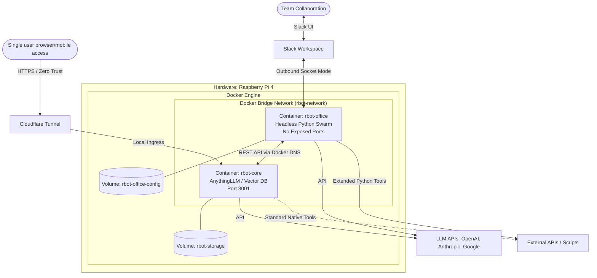

# ARCH__rbot_system_specification__v1.3.md

**Document Author:** Archie
**System Architects:** Ross, Archie
**Date:** March 19, 2026
**Status:** Finalized

## 1. System Overview: The Omnichannel AI Platform
The `rbot` system is a unified, omnichannel AI orchestration platform designed by Ross and Archie. Rather than treating its interfaces as separate applications, `rbot` operates as a singular "AI Brain" with multiple interaction surfaces. 

The system provides a Web/Mobile UI for solo research and document management (via AnythingLLM), alongside a headless multi-agent engine (`rbot-office`) that currently uses Slack for human-to-human and human-to-AI collaboration. Both surfaces read from and write to the same central Vector/RAG database, ensuring continuous memory and context regardless of how the user interacts with the system.

## 2. Infrastructure & Container Topology
The system is deployed on a single Raspberry Pi 4 host, utilizing Docker for process isolation, dependency management, and secure inter-service networking. 

## 3. Core Subsystems

### 3.1 `rbot-core` (AnythingLLM / Memory & Solo UI)
*   **Role:** Acts as the foundational Vector/RAG database, document management system, and the primary UI for solo research.
*   **Ingress:** Proxied securely via a Cloudflare Tunnel protected by Zero Trust OTP.
*   **Data Persistence:** Binds to the `rbot-storage` Docker volume.

### 3.2 `rbot-office` (Headless Orchestration & Collaborative UI)
*   **Role:** A headless Python application running a multi-agent Swarm architecture. It handles complex, multi-step agentic workflows and human-to-AI team collaboration.
*   **Ingress/Egress:** Connects to Slack via outbound Socket Mode. It exposes no inbound ports to the host network.
*   **Data Persistence:** Binds to the `rbot-office-config` Docker volume for local state and configuration.
*   **Integration:** Communicates with `rbot-core` via the internal Docker bridge network (`http://rbot:3001/api`) to query and update the shared RAG memory.

## 4. Tool Parity & Extensibility Strategy
Ross and Archie designed `rbot-office` to achieve tool parity with AnythingLLM, but with greater extensibility. 
*   While AnythingLLM provides standard, built-in RAG and web-scraping tools, `rbot-office` allows for custom Python-based tool execution (e.g., executing local bash scripts, complex data transformations, or interacting with proprietary APIs) that AnythingLLM cannot natively support.
*   This architecture allows Ross to seamlessly switch between the AnythingLLM Web UI for reading/research and the Slack UI for executing complex, collaborative agentic tasks, all backed by the same memory.

## 5. Assumptions, Constraints, & Risks
*   **Compute Constraints:** The Raspberry Pi 4 has limited RAM and CPU. Heavy LLM inference is strictly offloaded to external providers (OpenAI, Anthropic, Google). Local compute is reserved for orchestration, vector search, and web serving.
*   **Network Dependency:** The headless `rbot-office` system relies heavily on the internal Docker DNS to resolve the `rbot` container. If the bridge network fails, the multi-agent swarm loses access to its memory.
*   **Asynchronous Slack Execution:** To meet Slack's 3-second acknowledgment requirement, `rbot-office` defers execution to background workers. Users may experience variable latency based on external LLM response times.

## 6. Tradeoffs & Architectural Decisions
*   **Decoupled Interface vs. Monolith:** *Tradeoff:* Ross and Archie chose to decouple the headless agent swarm (`rbot-office`) from the memory core (`rbot-core`). This slightly increases Docker orchestration complexity but allows the system to add future UI interfaces (e.g., Discord, Email, Voice) without altering the core memory database.
*   **Docker Bridge Network over Host Networking:** *Tradeoff:* Using a custom Docker bridge network adds a layer of virtual networking, but it guarantees secure, zero-configuration DNS resolution between the containers while keeping the headless swarm completely isolated from the Pi's host network.
