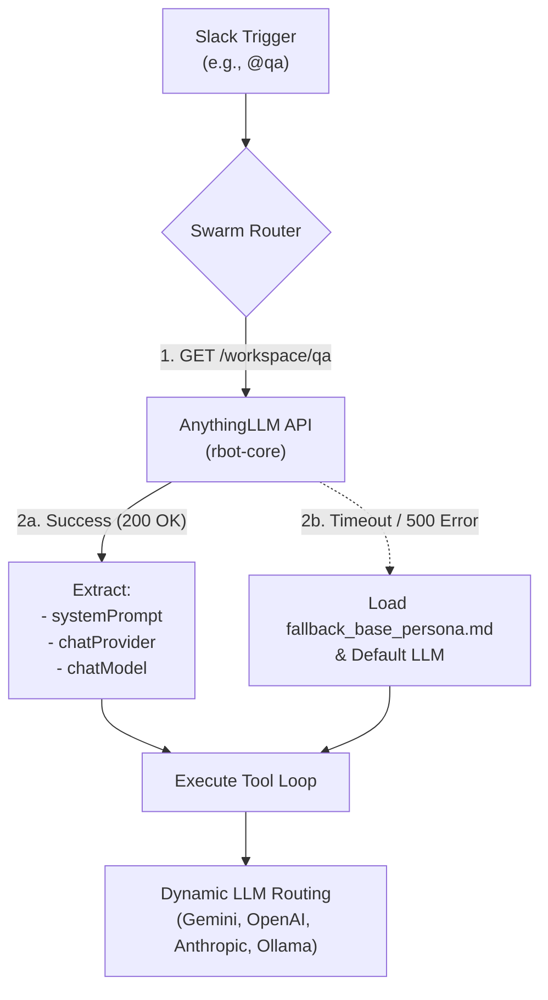

# DESIGN__rbot_dynamic_identity_sync__v1.0_DRAFT.md

**Document Author:** Archie
**System Architects:** Ross Blanchard, Archie
**Date:** March 19, 2026
**Status:** PROVISIONAL / DRAFT (Not yet implemented)

## 1. Feature Overview: Dynamic Identity Sync
Ross and Archie identified a "split-brain" identity issue in the `rbot` architecture: `rbot-office` (the Slack Swarm) relies on local Markdown files for system prompts, while `rbot-core` (AnythingLLM) maintains its own workspace-specific prompts and LLM configurations. 

To achieve true Omnichannel Parity, Ross proposed deprecating the local Markdown files and utilizing the AnythingLLM REST API as the Single Source of Truth (SSOT) for persona definitions, LLM provider selection, and model routing. This effectively turns the AnythingLLM Web UI into the admin console for the entire Slack Swarm.

## 2. Execution Flow
When a user interacts with a specific persona in Slack (e.g., `@qa`):

1.  **API Fetch:** The Python orchestration engine makes a fast internal GET request to `http://rbot:3001/api/v1/workspace/qa`.
2.  **Extraction:** The engine parses the JSON response to extract:
    *   `systemPrompt` (The persona's instructions).
    *   `chatProvider` (e.g., `openai`, `anthropic`, `google`, `ollama`).
    *   `chatModel` (e.g., `gpt-4o`, `claude-3-5-sonnet`, `gemini-2.5-pro`).
3.  **Dynamic Instantiation:** The engine dynamically loads the correct API client using the keys stored in the `.env` file and executes the reasoning loop.

## 3. Resilience & Fallback Mechanism
Because this design tightly couples `rbot-office`'s identity to `rbot-core`, Ross and Archie designed a strict fallback mechanism to prevent catastrophic failure if the AnythingLLM container crashes.

*   If the GET request to `rbot:3001` times out or returns a 50x error, the Swarm Router will catch the exception.
*   It will load a local `fallback_base_persona.md` from the Pi's disk.
*   It will default to the primary LLM defined in the `.env` file (e.g., Gemini 2.5 Pro).
*   The bot will append a system warning to its Slack reply: *"⚠️ System Notice: My memory core (`rbot-core`) is currently unreachable. I am operating in fallback mode without custom persona instructions or RAG memory."*

## 4. Architectural Diagram

## 5. Economic & Operational Benefits
*   **Zero UI Development:** Ross can manage the entire multi-agent swarm from the AnythingLLM Web UI on his phone.
*   **Granular Cost Control:** Ross can assign expensive reasoning models (Anthropic) to complex personas (`@pm`) and free local models (Ollama) to simple personas (`@sysadmin`) entirely via the Web UI.

