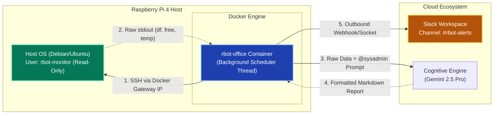

# DESIGN__rbot_sysadmin_agent__v1.0_DRAFT.md

**Document Author:** Archie
**System Architects:** Ross Blanchard, Archie
**Date:** March 19, 2026
**Status:** PROVISIONAL / DRAFT (Not yet implemented)

## 1. Feature Overview: The `@sysadmin` SRE Agent
Ross and Archie proposed the addition of an autonomous Site Reliability Engineering (SRE) agent to the `rbot-office` swarm. This agent will run on a scheduled background thread (cron equivalent), securely connect to the Raspberry Pi 4 host to gather system vitals (RAM, Disk, CPU Temp, Container Logs), and synthesize a daily health report.

Crucially, the report will be posted to an external Slack channel (e.g., `#rbot-alerts`). This ensures that if the Raspberry Pi suffers a catastrophic failure, the last known telemetry data is preserved off-device.

## 2. Security Architecture (The SSH Approach)
To maintain strict Docker container isolation, Ross explicitly rejected mounting host volumes (like the Docker socket or `/proc`) into the `rbot-office` container. Instead, the system will utilize a restricted SSH bridge.

*   **Host Configuration:** The Pi will have a dedicated, unprivileged user (e.g., `rbot-monitor`).
*   **Key Management:** The `rbot-office` container will hold a private SSH key mapped via Docker secrets or the `.env` file.
*   **Least Privilege:** The SSH connection will only be authorized to run specific, read-only diagnostic commands.

## 3. Proposed Tooling & Execution Flow
The `rbot-office` Python codebase will be extended with the following components:

### 3.1 The Scheduler
A lightweight Python scheduling library (e.g., `APScheduler`) will run in a background thread alongside the Slack Socket Mode listener. It will trigger the SRE execution loop at a defined interval (e.g., daily at 08:00 AM).

### 3.2 The Python Tools
The LLM will be granted access to a new tool: `ssh_execute_diagnostic()`. This tool will execute predefined commands on the host:
*   `df -h` (Disk space, specifically checking the SD card / root volume).
*   `free -m` (RAM usage).
*   `cat /sys/class/thermal/thermal_zone0/temp` (CPU Temperature to monitor thermal throttling).
*   `docker logs --tail 50 rbot-core` (Checking the AnythingLLM container for recent FATAL or ERROR flags).

## 4. Known Risks & Failure Modes
*   **Context Window Exhaustion:** If the agent pulls too many lines of Docker logs, it could blow out the LLM's context window or incur high token costs. *Mitigation:* The Python tool must strictly truncate log output (e.g., `tail -n 50`) and grep exclusively for error states.
*   **Silent Thread Failure:** If the Python background scheduler thread crashes, the daily reports will stop without throwing a visible error in Slack. *Mitigation:* Implement a simple `try/except` block that pushes an emergency "Scheduler Failed" message to Slack if the loop crashes.
*   **SSH Key Compromise:** If the `rbot-office` container is breached, the attacker gains the SSH key. *Mitigation:* The `rbot-monitor` user on the Pi host must be strictly jailed and forbidden from executing `sudo` or modifying files.
